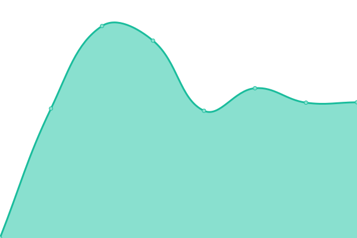

# [📈 Live Status](https://foto-andreas.github.io/Uptime-QL): <!--live status--> **🟩 All systems operational**

<!--start: status pages-->
<!-- This summary is generated by Upptime (https://github.com/upptime/upptime) -->
<!-- Do not edit this manually, your changes will be overwritten -->
<!-- prettier-ignore -->
| URL | Status | History | Response Time | Uptime |
| --- | ------ | ------- | ------------- | ------ |
|  [Q-Learning](https://q-learning.de) | 🟩 Up | [q-learning.yml](https://github.com/foto-andreas/Uptime-QL/commits/HEAD/history/q-learning.yml) | 

 1565ms
     
 | 

<a href="https://foto-andreas.github.io/Uptime-QL/history/q-learning">100.00%</a>
    

|  [Q-Learning Campus](https://q-learning-campus.de) | 🟩 Up | [q-learning-campus.yml](https://github.com/foto-andreas/Uptime-QL/commits/HEAD/history/q-learning-campus.yml) | 

 1012ms
     
 | 

<a href="https://foto-andreas.github.io/Uptime-QL/history/q-learning-campus">100.00%</a>
    

<!--end: status pages-->

[**Visit our status website →**](https://upptime.github.io/upptime)

## 📄 License

- Powered by: [Upptime](https://github.com/upptime/upptime)
- Code: [MIT](./LICENSE) © [Upptime](https://upptime.js.org)
- Data in the `./history` directory: [Open Database License](https://opendatacommons.org/licenses/odbl/1-0/)
